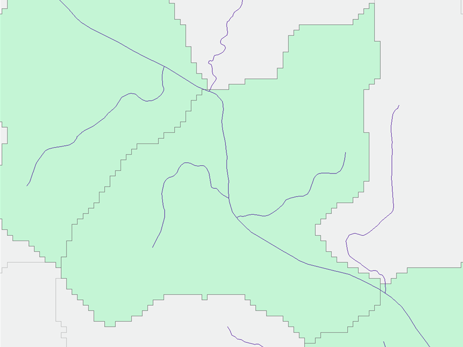

# NHDHRDV2.1

This repository contains scripts used to update the NHDHRDV2 (link) catchment layers representing the immediate drainages into large rivers. Specifically, it is necessary to capture the small tributary drainages that flow directly into large rivers. In some cases these tributaries are too small to have been captured by the minimum drainage area threshold established in Version 2. Instead, the small tributaries are encompassed by a single catchment representing the area immediately flowing into a reach on the mainstem of a large river. 

[[IMAGE]]. 

The update in Version 2.1 addresses the need to differentiate between the landscape attributes of the drainage contributing directly to the mainstem reaches from the reaches themselves which receive flow from a large upstream area. Edits are made only to catchments with a 200 sq km or greater drainage area. Each of these catchments is split into 3 new catchments: one representing the river channel, and one on each side of the channel representing the immediate contributing drainage area to the reach. [[IMAGE]]

# Processing
A series of R and ArcPython scripts are used to create the new version of catchments.

## Pre-processing

Interim layers from the delineaiton processing in Version 2 are used in this update. The `strLnkFinal` raster layer and `correctFlowlines` vector layer are both used in creating the new catchments. These layers exist by hydrologic region only and must be aggregated to create layers for the entire range before use in the Version 2.1 processing. This is done simply using the "Merge" tool for the vector layers and the "Mosaic to New Raster" tool for the raster layers. 

## Identify Features to Split

### Description
The existing catchment attribute tables are used to determine which catchments will be broken into separate channel and landscape(name?) sections. A total upstream drainage area (measured from the pour point of the catchment) is set at 200 sq km. The process generates two tables to indicate the catchments to be split and the flowlines used to do the splitting.

### Execution
Open the `identifyFeatures.R` script. In the "Specify inputs" section change the following variables: 
- areaDirectory  - The directory containing the catchment attribute tables defining upstream area
- catchmentDirectory - The directory containing the catchment attribute tables defining the network structure. These tables are the DBF files associated with the spatial catchment layers.
- outDirectory - The directory to ouput the tables to
- hydroRegions - The hydrologic regions of NHDHRDV2 to be processed

Execute the script in R. 

### Output
Two separate tables are generated. The `splitCatchments.dbf` indicates the catchments to be edited. The `splitFlowlines.dbf` table indicates the flowlines used to split the catchments. The tables will be used in the spatial processing and include the FEATUREID, upstream drainage area, and the network structure field ("NextDownID"). The flowlines table differs in that it contains one feature extending upstream so as to preserve continuity when splitting the catchments. 

## Split the Catchments

### Description
The spatial processing is divided into two scripts. The first script splits apart the select catchments using the raw version of the `truncatedFlowlines` layer from the Version 2 processing steps. These layers, the `correctedFlowlines` have not been smoothed and line up more cleanly with the catchments since both are derived directly from the same 30m DEM.

### Execution
Because the number of catchments to edit is small enough, the script does not loop through the different hydrologic zones and instead refers to the aggregated layer of all catchments. 

Open the `splitCatchments.py` script. In the "Specify inputs" section change the following variables: 
- catchments - The path to the aggregated spatial layer of all of the existing catchments from Version 2. 
- flowlines - The path to the aggregated spatial layer of all of the raw truncated flowlines from Version 2. 
- splitFlowlines - The path to the table of flowlines created from the previous step. 
- splitCatchments - The path to the table of catchments created from the previous step. 
- baseDirectory - The parent directory of the Version 2.1 project

Execute the script in Arc Python. This script may run into some issues in Arc. The use of the "Erase" tool in this case can cause the program to crash without warning or error report. If this happens, reopen the program and redefine the script up to the end of the "Define Functions" section. Delete the partially created layers (e.g. "select_polygons_erase") and re-run the script from the end of the last successfully completed process. This is likely just re-executing the "Erase" tool. 

### Output
The script outputs a number of layers during the processing, two of which are used in the next script. The `cats` layer represents the catchments to be edited, indicated by the `splitCatchments.dbf` table. The `mainstem_split_catchments` layer is the product of the `cats` layer being split by the selected `correctedFlowlines`. Both of these layers are used in the next script to generate the final product.

## Create Channel Catchments

### Description
The second spatial processsing script finalizes the new catchments. The main channel catchments are generated and merged  with the existing split landscape catchments. The resulting layer is the new version of the selected catchments, set to replace the matching catchments from Version 2. 

### Execution
Open the `addChannelCatchments.py` script. In the "Specify inputs" section change the following variables: 
- baseDirectory - The parent directory of the Version 2.1 project
- flowGrid - The path to the aggregated stream grid for all regions from Version 2. 

Execute the script in Arc Python. 

### Output
The script outputs the `mainstemCatchments.shp` layer. This layer is the finalized version of the edited catchments that may be joined into the original catchment layers from Version 2. 

## Edit Original Catchments

### Description
This script joins the split catchments from the `mainstemCatchments.shp` layer into the existing catchment layers.

### Execution
Open the `incorporateNewCatchments.py` script. In the "Specify inputs" section change the following variables: 
- baseDirectory - The parent directory of the Version 2.1 project
- hydroRegions - The hydrologic regions of NHDHRDV2 to be processed
- original_db - The path to geodatabase containing all of the existing catchments layers

Execute the script in Arc Python. 

### Output

The catchment layer for each region (e.g. `Catchments01`) are output to the previously created `hydrography.gdb` geodatabase in the `products` subfolder. Newly created catchments are assigned new FEATUREIDs. An additional column called "NativeID" is added to the attribute table to indicate the original FEATUREID. Additionally, the "Source" column of the edited catchments is updated to read: "Mainstem Split".

